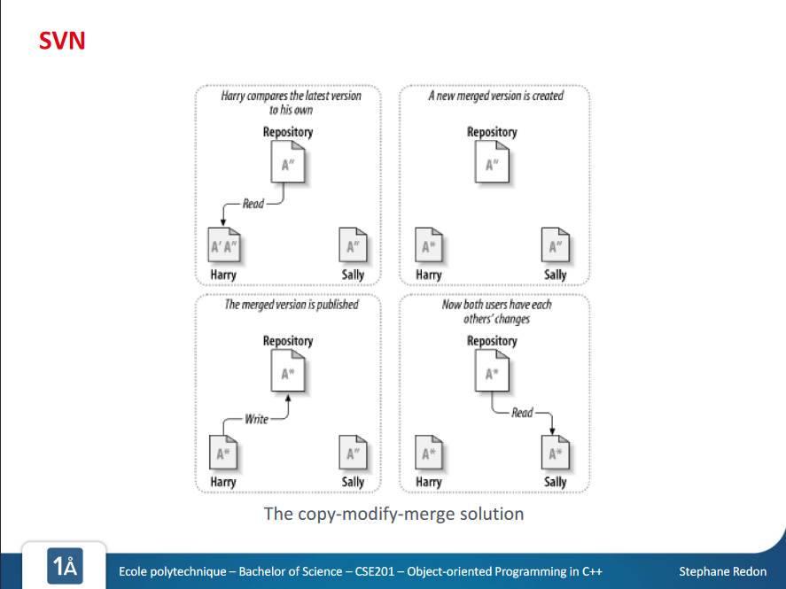

# CSE201: Object-oriented programming with C++

[Moodle Page](https://moodle.polytechnique.fr/course/view.php?id=14938)

[Grading scheme](https://www.enseignement.polytechnique.fr/informatique/CSE201/td/0/evaluation.html)

<details><summary>Lecture 1</summary>
<p>

[PowerPoint](https://moodle.polytechnique.fr/pluginfile.php/482963/mod_resource/content/12/CSE201%20-%20Object-oriented%20Programming%20in%20C%2B%2B%20-%20Session%201.pdf) 

Course structue: 

* 7 weeks - programming and software engineering
* 6 weeks - collaborative project 

```cpp
   // Your First C++ Program

  #include <iostream>

  int main() {
      std::cout << "Hello World!";
      return 0;
  }
```
   
## References and Pointers

- variables stored in memory, at a given **address**
- they *have* an **address** and *contain* a **value**


- a *reference* is a **supplementary name for a variable**
- syntax: `typeName& referenceName=variableName;`

```cpp
unsigned char i=165; // The variable i is stored at address 17
unsigned char& r=i; // r is just **another name** for i
```

- a *pointer* is a variable that **contains the address of another variable**
- syntax: `typeName* pointerName=&variableName;`

```cpp
unsigned char i=165; // The variable i is stored at address 17
unsigned char* r=&i; // The variable p contains the value 17, p is stored elsewhere
```

- p **points** to the variable i
- \*p **depoints** p

```cpp
unsigned char* p; // The variable p contains the address of i 
unsigned char *p; // The variable *p contains the value at the address p, so i
```

- you can do pointer arithmetics
- `p++;` adds the memory space of the object (moves to next object)


- A variable representing an array **"is" a pointer to the first element of the array**

```cpp
unsigned char i[10]; // i is a pointer to the first element
unsigned char* p=i; // p is equal to i
```
- p moves within the array (moves by memory length of `unsigned char`)

```cpp
*(p+4)=65; // affects 65 to the 5th element of the array
std::cout << i[4] << std:endl; // prints A (char corresponding to 65)
```
- when the program terminates, all allocated memory is cleared

## Tests

- Attention: `==` vs. `=`
```cpp
if(i==2){
    // enter if i is equal to 2
}
if(i=2){
    // i is now 2
    // 2 is converted to True, always enter statement
}
```

- `&&` : and
    - more efficiant than `&`
    - if first is `False`, doesn't test second
- `||` : or
- `=!` : not

</p>
</details>

<details>
<summary>Lecture 2</summary>
<p>

[PowerPoint](https://moodle.polytechnique.fr/mod/resource/view.php?id=304142)

## Loops
```cpp
// print "Hello" 10 times
for(int i=0; i<10;i++){
    std::out << "Hello" << std::endl;
}

// also prints "Hello" 10 times
int i = 0;
for(;;){
    if(i>= 10){break;}
    std::out << "Hello" << std::endl;
    i++;
}
```
- all statements are optional: `for(;;){}` is correct syntax
```cpp
while(condition_statement){
    //do something
}

do {
    //do something before testing condition
} while(condition_statement){
    //do something only if condition is true
}
```

## Functions
- Functions are used to **organize large programs**, and **avoid repetition**
- Structure 
    ```cpp
    returnTypeName functionName(arguments){
        statements
    }
    ```
- receives **zero or more arguments**
- has a **single return type** (may be `void`)
- When a function has to return something, the `return` keyword is used
- A function may **call other functions**, and even **call itself** ("recursive function")
- Two functions with the same name but different arguments **can co-exist**

Examples:
```cpp
double multiplyByTwo(double d){
    // receives one argument, a double called d
    double result = 2*d;
    return result;
    // this function prints nothing, but returns a double
}

double multiplyByTwo(double d){
    // In this case, the unnessecary temporary variable has been removed
    return 2*d;
}
```

- recursive functions bla bla bla

## Argument passing

- Functions may receive arguments **by value** or **by reference**
- When an argument is **passed by value, a copy of it is made**
    ```cpp
    void increment(int a){
        // i is a copy of the passed argument, even if it has the same name
        a++;
    }

    int main(){

        int i = 65;                     // affects 65 to i
        increment(i)                    // pass i by value to increment 
        std::cout << i << std:.endl;    // still prints 65

        return 0
    }
    ```
- When an argument is **passed by reference, it may be accessed by the function**
    ```cpp
    void increment(int& r){
        // r is a reference to the passed argument (not the &)
        r++;
    }

    int main(){

        int i = 65;                     // affects 65 to i
        increment(i)                    // pass i by reference to increment 
        std::cout << i << std:.endl;    // prints 66

        return 0
    }
    ```

## The stack

- second type of memory segment associated to an executable
- The stack is used for temporary memory storage:
    - variables declared in the function
    - arguments passed by value to functions
```cpp
int addToInteger(int& i, int increment) {

    int result=i+increment;
    return result;
}

int main() {

    int i= 65;                      // affects 65 to i
    i = addToInteger(i,2);          // add 2 to i
    std::cout << i << std::endl;    // prints 67

    return 0;
}
```
- How many variables stored in the stack? **3**
    - 2 declared in functions: `i` and `result`
    - 1 passed by value: `2`passed as an increment
</details>

<details>
<summary>Lecture 3</summary>
<p>

[PowerPoint](https://moodle.polytechnique.fr/mod/resource/view.php?id=304145)

## The heap

- third type of memory segment associated to an executable
- The heap is used to allocate memory that persists between functions
- in C++, the operator `new` is used to allocate on the heap
- in C++, the operator `delete` is used to de-allocate from the heap

```cpp
int main(){
    int* i = new int;     // i points to an int in the heap
    *i=65;                // affects 65 zo *i

    char* a=new char[10]; // a points to an array of chars in the heap
    a[4] = 'A';           // affects 'A' to the 5th element of the array

    delete i;             // free the memory pointed by i
    delete[] a;           // free the memory pointed by a

    return 0;
}
```
Who is on the stack? Who is in the heap?

- pointers `a` and `i` are in the stack
- values `65` and `'A'` affected to variables are in the heap

## SVN 

- Collaborative source-code writing tool 
    - One **central repository** created on a remote server
    - One **local repository** per developer
- Initially, a developer **checks out** the repository (i.e. makes their local copy)
- Then, the developer may:
    - **Modify** the code
    - **Update** their local repository based on the central repository
    - **Commit** their changes to the central repository
- Use tools with GUI to make it easier (e.g. TortoiseSVN / Pageant on Windows)





SVN is a centralized version control system:


## Git
<p>

Git is a distributed version control system:


- **Distributed version control system**
    - Everyone clones the **whole** repository (which contains the complete history)
    - The fact that one repository is seen as the main one (e.g. gitlab) is **artificial**
    - One has a **local** repository connected to one (or more) **remote** repositories
- **Two sets of communication demands**
    - Dealing with one's own **local repository**
        - &larr; **checkout**: from local repository to working copy
        - &rarr; **commit**: from working copy to local repository
    - Dealing with **remote repositories (a.k.a. syncing)**
        - &larr; **fetch**: obtain remote commits, but **marked as remote commits**
        - &larr; **pull**: fetch + merge branch into local branch
        - &rarr; **push**: from local repository to remote repository

<p>
Even with an artificially denoted "centralized" repository (such as github), Git makes it possible to communicate between "local" repositories

- Branches should be used **all the time**
    - For **developing new features**
    - For **preparing releases**
    - For **fixing bugs**
- Most branches are created temporarily , then merged and deleted
- For CSE201, within each project, there could be branches for "sub-projects"
</details>