# CSE202: Design and Analysis of Algorithms

<p>

[Moodle Page](https://moodle.polytechnique.fr/course/view.php?id=14939)

<details>
<summary>Lecture 1</summary>
  
<p>

[Power point](https://moodle.polytechnique.fr/pluginfile.php/482989/mod_resource/content/2/01-overview.pdf)
  
## Algorithms

An algorithm needs:
 1. A well-specified problem
 2. A method to solve it


An algorithm is *correct* if 
 1. it terminates
 2. it computes what its specification claims

Useful proof technique: look for **variants** and **invariants**:

```python
# Input:  x that can be multiplied
#         n nonnegative integer
# Output: x^n
def binpow(x,n):
  if n==0: return 1
  # n>0
  tmp = binpow(x,n//2) # n//2 < n
  # tmp = x^(n//2)
  tmp = tmp*tmp
  if n%2==0: return tmp
  return tmp*x
```

**Termination** is a very hard problem
- the general problem is **undecidable**

## Complexity

*How long will my program take?*
*Do I have enough money?*
  
The scientific approach:
  1. Experiment for various sizes;
  2. Model;
  3. Analyze the model;
  4. validate with experiments;
  5. If necessary, go to 2.
                                 
### Experimental Determination of (Polynomial) complexity

If the time for a computation grows like $C(n) \sim Kn^\alpha log^pn$ <br>
then doubling $n$ should take time $C(2n) \sim K2^\alpha n^\alpha log^pn$ <br>
so that $$\alpha \approx log_2 \left (\dfrac{C(2n)}{C(n)} \right ) $$

### Notation

- $f(n) \sim g(n)$ means $\lim_{n \to \infty} f(n)/g(n) = 1$
- $f(n) = O(g(n))$ means $\exists K \exists M \forall n \geq M, |f(n)| \leq Kg(n)$
- $f(n) = \Theta (g(n))$ means $f(n) = O(g(n))$ and $g(n) = O(f(n))$

### Moore's "law"

The expression Moore's "law" is commonly used to mean that
> The speed and memory of computers is expected to **double every 18 months**.


## Lower Bounds

### Complexity of a problem

***Def.*** The *complexity of a problem* is that of the most efficient (possibly unknown) algorithm that solves it.

**Ex.** Sorting $n$ elements has complexity $O(nlogn)$ comparisons <br>
**Proof.** Mergesort (CSE103) reaches the bound

**Ex.** Sorting $n$ elements has complexity $\Theta (nlogn)$ comparisons. <br>
**Proof.** $k$ comparisons cannot distinguish more than $2^k$ permutations and $log_2(n!) \sim n log_2 (n)$

### Complexity of Powering

$$(x,n) \in \mathbb{A} \times \mathbb{N} \mapsto x^n \in \mathbb{A} $$

We already know it is $O(logn)$ multiplications in $\mathbb{A}$ <br>
*Can this be improved?*

> **Lower bounds** on the complexity require a precise definition (a **model**) of what operations the "most efficient" algorithm can perform.

**Ex.** If the only available operation in $\mathbb{A}$ is multiplication, $x^{2^k}$ requires $k$ multiplications, so that $log_2n$ is a lower bound.

**Ex.** In floating point arithmetic, $x^n = exp(nlogx)$ and the complexity hardly depends on $n$.

### Simple lower bounds

In most useful models, reading the input and writing the output take time. Then, 
$$\text{size(Input) + size(Output) } \leq \text{complexity}$$

## Reductions

Problem X **reduces to** problem Y if you can use an algorithm that solves Y to help solve X.
$$\text{Complexity of solving X} = \text{complexity of solving Y} + \text{cost of the reduction}$$

- complexity of solving Y: perhaps many calls to Y on instances of different sizes (typically, one call)
- cost of the reduction: preprocessing and postprocessing (typically, less than the cost of solving Y)
</details>

<details>
<summary>Lecture 2</summary>


[PowerPoint](https://moodle.polytechnique.fr/pluginfile.php/482992/mod_resource/content/2/02-Multiplication.pdf)

## Divide & Conquer 
### Example 1: How fast can we multiply?

- input: two $n$-digit integers
- output: at most $2n$ digits

<p>

- naive school multiplication:
  - each row: $n$ multiplications + $O(n)$ carries
  - last row: $O(n^2)$ additions + $O(n)$ carries
  - Total: $O(n^2)$ digit (or bit) operations

- Quadratic algorithm: #operations $O(n^2)$ for an input size $n$

<p>

The total cost may be
- mostly at the top (quickselect)
- mostly at the leaves (Karatsuba, Strassen)
- balanced along the levels (binary powering, mergesort)

### Polynomials

- Polynomials behave like integers, without carries
- cost: $(n_1+1)(n_2+1)$ multiplications + $O(n_1n_2)$ additions
<p>

$F$ and $G$ of degree $< n \mapsto H :=FG$

Algorithm: 
1. if $n=1$, return $FG$
2. Let $k:= \lceil \frac{n}{2} \rceil$
3. Split $F=F_0 + x^kF_1, G= G_0+x^kG_1$ <br>
    $F_0,F_1,G_0,G_1$ of degree $<k$
4. compute **recursively** <br>
  $H_0 := F_0G_0, H_1 := F_0G_1, H_2 := F_1G_0, H_3 :=F_1G_1$
5. return $H_0+x^k(H_1+H_2) + x^{2k}H_3$

**Complexity**: $C(n) \leq 4C(\lceil \frac{n}{2} \rceil) + \lambda n$ coefficient operations

$$

 \begin{align*}
C(n) &\leq 4C(\left \lceil \frac{n}{2} \right \rceil) + \lambda n \\
&\leq \lambda n +  4 \lambda (\left \lceil \frac{n}{2} \right \rceil) + 16 C(\left \lceil \frac{n}{2} \right \rceil _2) \\ 
&\leq \lambda (n +  2 (2 \left \lceil \frac{n}{2} \right \rceil) + \dots + 2^{k-1}( 2^{k-1} \left \lceil \frac{n}{2} \right \rceil _{k-1})) + 4^{k+1}C(\left \lceil \frac{n}{2} \right \rceil _k) \\ 
&\leq \lambda N (1+2+ \dots+2^{k-1}) + 4^kC \left(\left \lceil \frac{n}{2} \right \rceil_k \right) \\
&\leq 4^k \left(\lambda \dfrac{N}{2^k} + C(\left \lceil \frac{n}{2} \right \rceil_k) \right) \\
&\leq (\lambda +1)4^{\lceil \log_2n \rceil}= O(n^2)
 \end{align*}
$$


Notation: 
- $\left \lceil \frac{n}{2} \right \rceil_1 = \left \lceil \frac{n}{2} \right \rceil$ 
- $\left \lceil \frac{n}{2} \right \rceil_{k+1} = \left \lceil \left \lceil \frac{n}{2} \right \rceil_k/2 \right \rceil$ 
- $N:$ power of $2$ s.t. <br>
$n \leq N < 2n$

#### Polynomials of Degree 1

$$F= f_0+f_1T, G= g_0+g_1T \mapsto G:= FG = h_0 + h_1T+ h_2T^2$$

Naive algorithm:
$$H = (f_0g_0) + (f_0g_1+f_1g_0)T+ f_1g_1T^2$$
Thus: $4$ multiplications and $1$ addition

Interpolation from **$3$** values:

$$\begin{align*}
h_0 &= F(0)G(0) = f_0g_0 \\
h_2 &= "F(\infty)G(\infty)" = f_1g_1 \\
 \tilde h_1 &= h_0 + h_1 + h_2 = F(1)G(1) = (f_0+f_1)(g_0+g_1) 
 \end{align*}$$
$$FG = h_0 + (\tilde h_1-h_0-h_2)T + h_2T^2$$
**$3$** multilplications, $2$ additions, $2$ substractions

#### Karatsuba's Algorithm

$F$ and $G$ of degree $<n \mapsto H :=FG$

**Idea**: Evaluate $FG = h_0 + (\tilde h_1-h_0-h_2)T + h_2T^2$ at $T=x^k$

Algorithm: 
1. if $n$ is small, use naive multiplication
2. Let $k:= \lceil \frac{n}{2} \rceil$
3. Split $F=F_0 + x^kF_1, G= G_0+x^kG_1$ <br>
    $F_0,F_1,G_0,G_1$ of degree $<k$
4. compute **recursively** <br>
  $H_0 := F_0G_0, H_2 := F_1G_1, \tilde H_1 :=(F_0+F_1)(G_0+G_1)$
5. return $H_0+x^k(\tilde H_1 - H_0 -H_2) + x^{2k}H_2$

Complexity: $C(n) \leq 3C(\left \lceil \frac{n}{2} \right \rceil) + \lambda n$ coefficient operations

$$
 \begin{align*}
C(n) &\leq 3C(\left \lceil \frac{n}{2} \right \rceil) + \lambda n \\
&\leq \lambda n +  3 \lambda (\left \lceil \frac{n}{2} \right \rceil) + 9 C(\left \lceil \frac{n}{2} \right \rceil _2) \\ 
&\leq \lambda N (1+ \frac{3}{2}+ \dots+(\frac{3}{2})^{k-1}) + 3^kC \left(\left \lceil \frac{n}{2} \right \rceil_k \right) \\
&\leq \lambda N \left(\frac{3}{2} \right)^{k-1}(1+ \frac{2}{3}+ \dots+(\frac{2}{3})^{k-1}) + 3^kC \left(\left \lceil \frac{n}{2} \right \rceil_k \right) \\
&\leq 3^k \left(2 \lambda \dfrac{N}{2^k} + C(\left \lceil \frac{n}{2} \right \rceil_k) \right) \\
&\leq (2 \lambda +1)3^{\lceil \log_2n \rceil}= O(n^{\log_23})
 \end{align*}
$$

### Integers

#### Karatsuba's Algorithm for Integers

$F$ and $G$ integers $<2^n \mapsto H:=FG$

Algorithm: 
1. if $n$ is small, use naive multiplication
2. Let $k:= \lceil \frac{n}{2} \rceil$
3. Split $F=F_0 + 2^kF_1, G= G_0+2^kG_1$ <br>
    $F_0,F_1,G_0,G_1<2^k$
4. compute **recursively** <br>
  $H_0 := F_0G_0, H_2 := F_1G_1, \tilde H_1 :=(F_0+F_1)(G_0+G_1)$
5. return $H_0+2^k(\tilde H_1 - H-0 -H_2) + 2^{2k}H_2$

Same algorithm as for polynomials, *similar* (not exactly the same) complexity analysis.

***$\rightarrow O(n^{\log_23})$*** bit operations

### Matrices

Input: two $n \times n$ matrices $A,X$ with $n=2^k$ 
<br>
Output: $AX$ with $AX_{ij} := \sum_{k=1}^nA_{ik}X_{kj}$


Strassen's algorithm:
1. if $n=1$, return $AX$
2. Split $A = \begin{pmatrix} a & b \\ c & d \end{pmatrix}, X = \begin{pmatrix} x & y \\ z & t \end{pmatrix}$ with $(n/2) \times (n/2)$ blocks
3. Compute recursively the $7$ products <br>
$q_1 = a(x+z), q_2 = d(y+t), q_3 = (d-a)(z-y),$ <br>
$q_4 = 8b-d)(z+t), q_5 = (b-a)z, q_6 = (c-a)(x+y), q_7 = (c-d)y$
4. Return $\begin{pmatrix}
q_1+q_5 & q_2+q_3+q_4-q_5 \\
q_1 + q_3 + q_6 - q_7 & q_2 + q_7
 \end{pmatrix}$

### Application: Graph Transitive Closure

**Def.** A *graph* is a pair $(V,E)$ where
1. $V$ is a finite set of nodes/vertices
2. $E \subseteq V \times V$ is a finite set of edges

Can be described as Adjacency matrix (Boolean matrix)

Boolean Multiplication:
$$c_{ij} = \bigvee_{k=1}^na_{ik} \wedge b_{kj}$$

Let $G=(V,E)$ be a graph.

A *path from i to j* is a sequence of edges $e1, \dots e_n$ such that:
- the source of $e_1$ is i and the target of $e_n$ is j
- For every $1 \leq k <n$, the target of $e_k$ is the source of $e_{k+1}$

The *transitive closure* $G^* = (V,E^*)$ is the graph where $(u,v) \in E^*$ iff there is a path from u to v

If A is the adjancency matrix of a graph G, then 

- $(A^k)_{ij} = 1$ iff there is a *path of length k* from i to j
- if $I$ is the identity matrix, then $(A \vee I)^k_{ij} = 1$ iff there exists a *path of length at most k* from i to j
-  $(A \vee I)^{n-1}$ is the adjacency matrix of G^*

The matrix $(A \vee I)^{n-1}$ can be computedd by *log n* squaring operations/multiplications $$O(n^{\log_27} \cdot \log_2n)$$

</details>

<details>
<summary>Lecture 3</summary>
<p>

[PowerPoint](https://moodle.polytechnique.fr/mod/resource/view.php?id=304169)

## Comparing Rankings

How similar are two rankings of n objects?

**Kendall-tau distance**
 : number of inversions between two rankings 

- inversion = pair $i < j$ such that $A[i]>A[j]$ 
- same as number of lines crossing when connecting same objects in two rankings

Algorithm: <br>
_Input._ An array A <br>
_Output._ Number of paris $i<j$ such that $A[i]>A[j]$

Complexity: <br>
Brute force algorithm: check all $O(n^2)$ pairs $i$ and $j$ <br>
Divide and Conquer: $O(n \log n)$

### Counting inversions: DAC

1. Divide into 2 sublists of equal size
2. Recursively count the inversions
3. Combine: add recursive counts plus inversions between sublists 

Variation of **merge-sort** <br>
**Combine:** count inversions between sublists
- assume each half is sorted
- count inversions where $A[i]$ and $A[j]$ are in different halves
- merge two halves into sorted whole 

**Merge and count**: count inversions while merging the two sorted lists

### Sort and Count Algorithm

```
Sort-and-Count(A):
  if A has one element
    return (0,A)

  Divide A into two halves A1,A2
  (r1,A1) <- Sort-and-Count(A1)
  (r2,A2) <- Sort-and-Count(A2)

  (rC,A) <- Merge-and-Count(A1,A2)
  return (r1+r2+rC,A)
```
```
Merge-and-Count(A1,A2):
  initialize an empty array B
  Inv <- 0

  if A1 or A2 is empty 
    return (0,nonempty list)

  Compare first elems of A1, A2
  If the smallest is in A1:
    move it at the end of B
  Else
    move it at the end of B
    Inv += |A1|

  return (Inv,B)
```
Complexity:

$$
 \begin{align*}
C(n) &\leq 2C(\lceil n/2 \rceil) + \lambda n \\
&\leq \lambda n 2 \lambda \lceil n/2 \rceil + 4C(\lceil n/2 \rceil_2) \\
&\leq \lambda N (1+1+1+ \dots+1) + 2^kC(\lceil n/2 \rceil_k) \\
&\leq \lambda N (k-1) +  2^kC(\lceil n/2 \rceil_k) \\
&= \lambda n (\lceil \log_2 n \rceil-1) + 2^{\lceil \log_2n \rceil} \\
&= O(n \log n)
 \end{align*}$$
(Where $N$: power of $2$ s.t. $n \leq N < 2n$)

## Selection: Linear Time with DAC

Complexity of DAC algorithms: <br>
- $O(\log n)$: binary powering
- $O(n \log n)$: merge sort, counting inversions
- $O(n^{\log_23} \approx n^{1.58})$: Karatsuba multiplication (integers, polynomials)
- $O(n^{\log_27} \approx n^{2.80})$: Strassen's matrix multiplication

### Statement of the Problem:

_Select:_ $(A:= \{a_1, \dots,a_n \},k) \mapsto x \in A$ s.t. $| \{a \in A| a \leq x \}| = k$

**Algorithm:** 
```
Select(A,k):
  If |A| = 1, return A[0]
  Choose a good pivot p
  q := Partition(A,p)
  If q=k return q
  If q>k return Select(A[:q],k)
  If q<k return Select(A[q:],k-q)
```
Worst case: $C(n) \leq C(n) + O(n) \rightarrow O(n^2)$

Complexity depends on $\left | q- |A|/2 \right |$ being small, need to choose good pivot

### Selection in worst-case linear time

_Goal._ Find pivot element p that divides list of n elements into two pieces so that each piece is guaranteed to have $\leq 7/10 n$ elements.

_Q._ How to find approximate median in linear time? <br>
_A._ recursively compute median of sample of $\leq 2/10n$ elements

$$
C(n) = 
  \begin{cases} 
  \Theta (1), &\text{if } n=1 \\
  C(7/10n) + C(2/10n) + \Theta (n), &\text{otherwise}
  \end{cases}
$$
To prove: $C(n) = \Theta (n)$

### Median-of-medians selection algorithm
```
MOM-Select(A,k):
  n <- |A|
  if n < 50:
    return k-th smallest element of A via mergesort
  Group A into n/5 groups of 5 elements each (ignore leftovers)
  B <- median of each group of 5
  p <- MOM-Select(B,n/10)

  (L,R) <- Partition(A,p)
  if (k<|L|) return MOM-select(L,k)
  else if (k>|L|) return MOM-select(R,k-|L|)
  else return p 
```

#### Complexity Analysis:

- At least half of $5$-element medians $\leq p$
- At least $(n/5)/2=n/10$ medians $\leq p$
- At least $3n/10$ elements $\leq p$ ($3$ for each median) 
- By same logic: At least $3n/10$ elements $\geq p$

MOM selection algorithm recurrence:
- select called recursively with $n/5$ elements to compute MOM $p$ <br>($=C(\lfloor n/5 \rfloor)$)
- at least $3/10 n$ elements $\leq p$
- at least $3/10 n$ elements $\leq p$
- select called recursively with at most $n-(3/10n)$ elements <br>($=C(n-3 \lfloor n/10 \rfloor)$)
- computing median of $5$: $\leq 6$ comparisons per group <br>($=6/5n$)
- partitioning: $\leq n$ comparisons <br>($=5/5n$)

$$C(n) \leq C(\lfloor n/5 \rfloor)+C(n-3 \lfloor n/10 \rfloor) + \frac{11}{5}n$$

#### Recurrence: 
$$C(n) \leq C(1/5n)+C(7/10n)+ \lambda n$$
$$C(x) + C(y) \leq C(x+y) \text{ (super-additive)}$$

<!-- 
$$\begin{align*}
  & & & &C(n) & & & &\\
  & &C(1/5n) & & & &C(7/10n) & &\leq C((1/5+7/10)n) \\
  &C((1/5)^2n) & &C(7/10 \cdot 1/5 n) & &C(1/5 \cdot 7/10 n) & &C((7/10)^2n) &\leq C((1/5+7/10)^2n) \\
  & & & &\dots & & & &\leq C((1/5+7/10)^kn) 
 \end{align*}$$
-->


$$\begin{align*}
C(n)&\leq C(9/10n) + \lambda n \\
&\leq C((9/10)^2n) + \lambda n (1+9/10) \\
&\leq C((9/10)^3n) + \lambda n(1+9/10+(9/10)^2) \\
&\dots \\
&\leq C(n_0) + \lambda n(1+9/10+(9/10)^2+ \dots) \\
&\leq C(n_0) + \lambda n \cdot 10 = O(n)
\end{align*}$$

</details>

<details>
<summary>Lecture 4</summary>
<p>

[PowerPoint](https://moodle.polytechnique.fr/pluginfile.php/483000/mod_resource/content/6/04-DAC3.pdf)

## Master Theorem

Divide and conquer has a recurrence given by: 
$$C(n) \leq mC(\lceil n/p \rceil) + f(n) \text{\qquad for } n \geq p$$

Example: $m=3$, $p=2$ and $f(n) = cn^\alpha$. Then:
$$\begin{align*}
C(n) &\leq 3C(n/2) + cn^\alpha \\
&\leq cn^\alpha + 3c(n/2)^\alpha + 9C(n/4) \\
&\leq cn^\alpha(1+3/2^\alpha)+9C(n/4) \\
&\dots \\
&\leq cn^\alpha(1+3/2^\alpha+ \dots+(3/2^\alpha)^{k-1}) + 3^kC(n/2^k) \\
&\leq cn^\alpha(1+3/2^\alpha+ \dots+(3/2^\alpha)^{\log_2n-1}) + 3^{\log_2n}C(1) \\
&\leq O \left(3^{\log_2n} \right) + cn^\alpha(1+3/2^\alpha+ \dots+(3/2^\alpha)^{\log_2n-1}) \\
&\leq O \left(n^{\log_2 3} \right) + cn^\alpha \cdot  
  \begin{cases}
  O(1), &\text{if } 2^\alpha>3, \\
  \log_2n, &\text{if } 2^\alpha=3, \\
  = \left(n^{\log_2(3)- \alpha} \right), &\text{if } 2^\alpha<3. 
  \end{cases}
\end{align*}$$


> **Master Theorem - Version 1**
>
> Assume $C(n) \leq mC(n \lceil n/p \rceil)+f(n)$ if $n \geq p$,  
> with $f(n) = cn^\alpha$ ($\alpha \geq 0$). Let $q = p^\alpha$.  
> Then, as $n \to \infty$,  
> $$C(n) = \begin{cases} O(n^\alpha), &\text{if } q>m, \\ O \left(n^\alpha \log n \right), &\text{if } q = m, \\ O \left(n^{\log_p m} \right), &\text{if } q<m. \end{cases}$$

**Proof when $n$ is a Power of $p$**
$$\begin{align*}
C(n) &\leq mC(n/p) + f(n) \\
&\leq f(n) + mf(n/p) + m^2C(n/p^2) \\
&\leq f(n)(1+m/q)+m^2C(n/p^2) \\
&\dots \\
&\leq f(n)(1+m/q+ \dots+(m/q)^{k-1}) + m^kC(n/p^k) \\
&\leq f(n)(1+m/q+ \dots+(m/q)^{\log_pn-1}) + m^{\log_pn}C(1) \\
&\leq O \left(m^{\log_pn} \right) + f(n)(1+m/q+ \dots+(m/q)^{\log_pn-1}) \\
&\leq O \left(n^{\log_mn} \right) + f(n) \cdot  
  \begin{cases}
  O(1), &\text{if } q>m, \\
  \log_pn, &\text{if } q=m, \\
  = \left(n^{\log_p(m/q)} \right), &\text{if } q<m. 
  \end{cases}
\end{align*}$$

> **Master Theorem - More general**
>
> Assume $C(n) \leq mC(n \lceil n/p \rceil)+f(n)$ if $n \geq p$, with $f(n)$ _increasing_   
> and there exist $(q,r)$ s.t. $q \leq f(pn)/f(n) \leq r$ for large enough $n$.    
> Then, as $n \to \infty$,  
> $$C(n) = \begin{cases} O(f(n)), &\text{if } q>m, \\ O \left(f(n) \log n \right), &\text{if } q = m, \\ O \left(f(n) n^{\log_p (m/q)} \right), &\text{if } q<m. \end{cases}$$
**Note 1.** The previous theorem is a special case of this.  
**Note 2.** A tighter value of $q$ gives a better complexity bound.

**Proof.**
Same as before but conclude with $N < pn \Rightarrow f(N) \leq rf(n) = O(f(n))$ and $n^{\log_p q} = O(f(n))$.

## Closest Pair of Points

**Problem.** Given $n$ points in the plane, find the _closest_ pair (normal distance).

_Naive method:_ compute all $O(n^2)$ pairwise distances, return pair with smallest one.  
_Divide and Conquer:_ split points into left and right, solve both subproblems (ok), **recombine** (hard).

**1D Approach.** Given $n$ points on a line, find the _closest_ pair 

_Solution:_ sort them in $O(n \cdot \log n)$ and traverse the list computing the distance from each point to the next.

_Sorting Solution for 2D:_
- sort by x-coordinate and consider nearby points
- sort by y-coordinate and consider nearby points

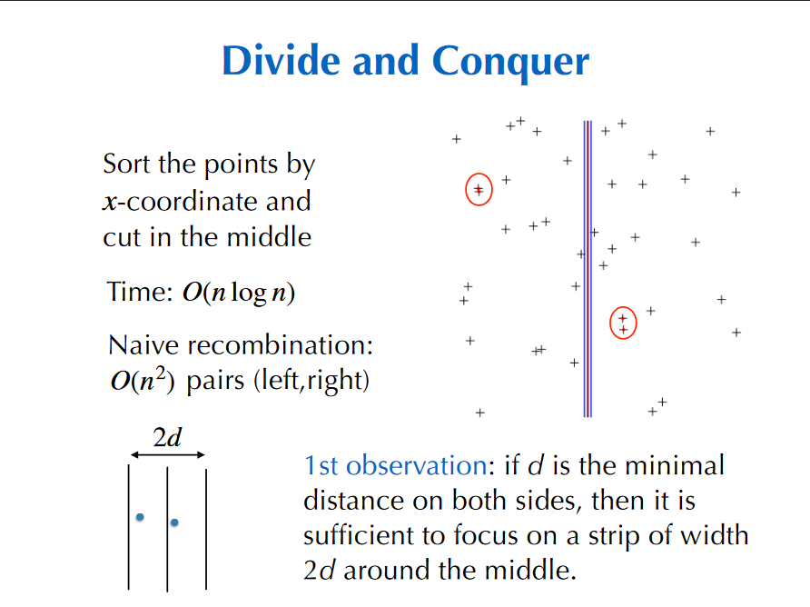

**Comparisons within a Strip**

> Each point has to be compared with _at most 7_  
> of the next ones for the $y$-coordinate

_Def._ Let $s_i$ be the point in the 3d-strip with the $i$-th smallest y-coordinate  
_Claim._ If $|j-i|>7$, then the distance between $s_i$ and $s_j$ is _at least d_

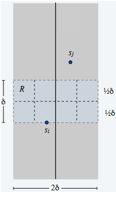

- Consider the 2d-by-d rectangle R in the strip whose min y-coordinate is the y-coordinate of $s_i$
- Distance between $s_i$ and any point $s_j$ above $R \geq d$
- Divide $R$ into 8 squares
- At most one point per square (from the definition of $d$ as min distance)
- At most 7 other points can be in $R$

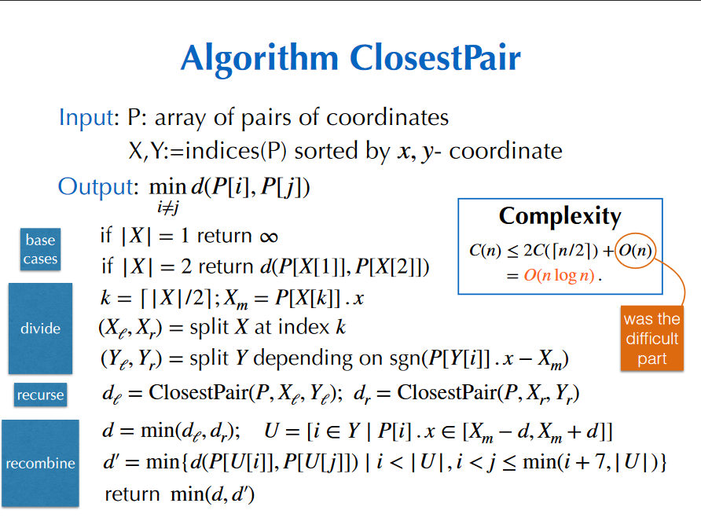
</details>

<details> 
<summary>Lecture 5</summary>
<p>

[PowerPoint](https://moodle.polytechnique.fr/pluginfile.php/483002/mod_resource/content/2/05-Random1.pdf)

## Randomized Algorithms

Two Flavours:
1. **Las Vegas:** always gives the correct answer. Running time is a random variable.
2. **Monte Carlo:** sometimes incorrect, but with bounded probability. 

### I. Toy Monte Carlo Example: Freivald's Algorithm

Simple way to check Matrix Product  
_Input:_ 3 $n \times n$ matrices.  
_Output:_ Check wether $A \times B = C$. 

Direct approach: compute $D=C-A\times B$ and test wether $D=0$. Complexity: $O(n^{2.38})$. 

**Freivald's algorithm:**  
1. Pick a random $v$ uniformly in $\{0,1\}^n$
2. Compute $w:= Cv - A(Bv)$
3. Return $(w==0)$

Complexity: $O(n^2)$ optimal. Might be wrong, but no too often.

#### Probability of error

Only possible error is when $D\neq 0$ but $w=0$.

$$\begin{align*} \mathbb{P}[D \neq 0 \wedge w = 0] &\leq \mathbb{P}[d \cdot v = 0], &&d \text{ non-zero row of } D \\
&= \mathbb{P}\left[d_iv_i = -\sum_{j>i}d_jv_j\right], &&\text{for the first } d_i \neq 0 \end{align*}$$

$d_iv_i$ takes 2 values, each with probability $1/2$, while the sum is independent of $d_i$. Thus, we get: 
$$\mathbb{P}[D \neq 0 \wedge w = 0] \leq 1/2$$

Repeating the algorithm $k$ times leads to 
$$\mathbb{P} [k \text{ errors}] \leq 1/2^k$$

$k= 10$ means a probability $\leq 0.1\%$  
$k = 100$ means a probability $\leq 10^{-30}$

### II. Another Monte Carlo Example: Min-Cut in a Graph

Let $G=(V,E)$ be an _undirected multi-graph_ (can have multiple edges between the same two vertices).

The **cut of a partition $(S,S')$** of $V$ is the set of edges that connect a vertex in $S$ with a vertex in $S'$.

**Global min cut:** given $G$, find a cut $(S,S')$ of _minimum cardinality_.

**Contraction Algorithm [Karger'95]**
1. Pick an edge $e=(u,v)$ uniformly at random
2. Contract edge $e$, i.e. $u$ absorbs $v$
    - delete edges between $u$ and $v$
    - redirect edges from $v$ to $u$
3. Repeat until multi-graph has just two nodes $u_1$ and $v_1$
4. Return the cut $(S,S')$ where $S$ is the set of nodes absorbed by $u_1$

#### Probability of Success

The contraction algorithm returns a min cut with probability $\geq \dfrac{2}{n(n-1)}$, where $n$ is the number of vertices.

Let $C$ be a min cut with $k$ edges.  
Let $e_1,\dots,e_{n-1}$ be the contracted edges (output is $C$ if none of them are in $C$)
- each vertex has degree at least $k$, thus there are at least $nk/2$ edges
- $e_1$ is in $C$ with probability $\dfrac{k}{\# edges}\leq \dfrac{2}{n}$ and not in $C$ with probability $\geq \dfrac{n-1}{n}$
- if $e_1$ is not in $C$, then $C$ is still a mincut of contraction $(G,e_1)$
- conditioned that $e_1,\dots,e_{i-1}$ are not in $C$, $e_i$ is not in $C$ with probability $\geq \dfrac{n-i-1}{n-i+1}$ (after contracting $e_1\dots,e_{i-1}$, the graph has $n-i+1$ vertices)
- The probability that none of $e_1,\dots,e_{n-2}$ is in $C$ is at least
$$\dfrac{n-1}{n} \cdot \dfrac{n-3}{n-1} \cdot \dfrac{n-4}{n-2} \cdots \dfrac{2}{4} \cdot \dfrac{1}{3} = \dfrac{2}{n(n-1)}$$

#### Boosting the Probability

If we repeat the algorithm $n^2\log{n}$ times, then the probability of _failing_ to find the min cut is $\leq 1/n^2$. Complexity: $O(n^4\log{n})$

**Imporved Contraction Algorithm**
1. $n$ is the number of nodes
2. If $n\leq 6$, use brute-force enumeration
3. $t = \left \lceil 1 + \dfrac{n}{\sqrt{2}} \right \rceil
4. Perform two independent contraction sequences to obtain $H_1$ and $H_2$ each with $t$ vertices
5. Recursively compute min-cuts in each $H_1$ and $H_2$
6. Return the smaller of the two min-cuts

IN the first contraction, hitting an edge in min-cut has low probability (50% when t vertices remain)

Probability of success $\geq \dfrac{1}{\log{n}}$  
Complexity: $O(n^2\log{n})$

### III. Quicksort

**Quicksort Partitioning**  
_Input._ an array of $n$ comparable elements, a privot $p$ among them  
_Output._ array partitioned around $p$; new index of $p$  

Complexity: $n-1$ comparisons

**Quicksort**
1. Partition
2. Sort subarrays recursively

#### Deterministic variant:
```python
def partition(A,lo,hi):
  p = A[lo]; i=lo; j=hi
  while True:
    for i in range(i+1,hi):
      if A[i]>=p: break
    for j in range(j-1,lo-1,-1):
      if A[j]<=p: break
    if i>=j: break
    A[i],A[j] = A[j],A[i]
  A[lo],A[j]=A[j],A[lo]
  return j

def sort(A):
  quicksort(A,0,len(A))

def quicksort(A,lo,hi):
  if hi <= lo +1: return
  q = partition(A,lo,hi)
  quicksort(A,lo,q)
  quicksort(A,q+1,hi)
```

Worst case complexity: $O(n^2)$ comparisons  

Average-Case Complexity:  
_**Strong Hypothesis** the keys are distinct and all permutations of the input are equally likely_

Observation: This property is preserved by partitioning

$C_n :=$ num. comparisons, $C_0 = 0$  
$C_n = n-1 + C_{i-1} + C_{n-i}$ if pivot at index $i$ (prob $1/n$)  

_Average_ number of comparisons $E_N := \mathbb{E}(C_n)$
$$\begin{align*} 
E_n &= n-1 + \sum_{i=1}^n \dfrac{E_{i-1}+E_{n-i}}{n} \\
&= 2(n+1) \left(1+\dfrac{1}{2}+\cdots+\dfrac{1}{n} \right)-4n \\
&= 2n\log{n} + 2(\gamma-2)n + O(1) \approx 1.39n\log_2{n}-2.85n
\end{align*}$$

#### Randomized version:
```python
import random
def sort(A):
  random.shuffle(A)
  quicksort(A,=,len(A))
```

Now, for _arbitrarily bad input_, the _expected_ number of comparisons is 
$$\approx 2n\log{n}-2.85n$$
The worst-case remains quadratic, but unlikely

||Quicksort|Mergesort| 
| --- | :---: | :---: |
|running time | $n\log{n}$ | $n\log{n}$ |
|in place? | yes | no |
|extra space | $\log{n}$ | $n$ |
|deterministic | no | yes |

#### Further improvements

- _Median-of-three_ partitioning for better pivots:  
    > Take 3 elements at random;  
    > use their median as the pivot;  
    > (bonus) the other two as sentinelse.  
    > $\approx \dfrac{12}{7} n \log{n}$, 30% improvement  
- _Cutoff_ to insertion sort: stop recursion at size $\approx 10$  
  one sweep of insertion sort on the whole array  
- _Three-way partitioning_ for duplicate keys

### IV. QuickSelect

_Select:_ $(A:=\{a_1,\dots,a_n\},k) \mapsto x \in A$ s.t. $|\{a \in A|a\leq x\}| = k$  
_Median:_ Select with $k = \lfloor n/2 \rfloor$

Sorting gives an algorithm in $O(n\log{n})$ comparisons

```python
def select(A,k):
  random.shuffle(A)
  return quickselect(A,0,len(A),k)

def quickselect(A,lo,hi,k):
  q = partition(A,lo,hi)
  if q==k: return A[q]
  if q>k: return quickselect(A,lo,q,k)
  return quickselect(A,q+1,hi,k)
```

Only a _linear_ number of comparisons

**Simple Linear Upper Bound:**
$$\begin{align*}
E_n &\leq n-1 + \dfrac{1}{n} \sum_{i=1}^n E_{max(i-1,n-i)} \\
&\leq n-1 \dfrac{2}{n} \sum_{i=\lceil n/2 \rceil}^{n-1} E_i + 
\begin{cases}
\frac{1}{n}E_{\lfloor n/2 \rfloor}, &\text{if $n$ if odd,} \\
0, &\text{otherwise}
\end{cases}
\end{align*}$$
Then, by induction $E_n \leq 4n+1$.

**Proof.**
$$\begin{align*} 
&n-1 + \dfrac{2}{n} \sum_{i=\lceil n/2 \rceil}^{n-1} (4i+1) + \dfrac{1}{n}(2n+1) \\
&\leq n-1 \dfrac{2}{n} \left (  \dfrac{n}{4}\left( (2n+1) + 4(n-1) +1 \right)  \right) + \dfrac{1}{n}(2n+1)  \\
&= 2n + \dfrac{1}{n}
\end{align*}$$
</details>

<details>
<summary> Lecture 6 </summary>

<p>

[Powerpoint](https://moodle.polytechnique.fr/mod/resource/view.php?id=304180)

### Recall: Hash Functions (CSE101)

> **Def.** A _hash funtion_ $h$ maps objcts from a given universe (e.g., integers, floats, strings, files, ...) to integers in a prescribed range.

Desirable properties:
- fast computation of $h$
- when $a \neq b$, $h(a)= h(b)$ should be unlikely
- in cryptographic applications, no information on $a$ should be accessible from $h(a)$

Applications:
- Hash tables: This lecture
- Fingerprinting: check that a file ahs not been corrupted / modified; detect duplicate data; avoid backup of unchanged portions of a file; search pattern in a text (next tutorial)

### Hash tables

#### Python Hash Codes (Simplified)

Python's built-in `hash` returns a 64-bit integer

- _Integers:_ $a \mod{p}$ ($p := 2^{61}-1$ prime)
- _Rational & Floating-Point Numbers:_ same reduction
- _Tuples_ can be hashed as $(a_0,a_1,a_2) \mapsto (a_2x+a_1)x + a_0 \mod{p}$ ($x<p$ and large)
- _Strings_ can be viewed as tuples of characters

> For a range $0,\dots,m-1$, use $hash(a) \mod{m}$

Worst-case: all keys hashed to the same value  
_Randomization:_ make $x$ session dependent

#### Assumptions on Hash Functions

$$h: k \in U \mapsto h(k) \in \{0,\dots,m-1\}$$
_Complexity:_ $h(k)$ computed in $O(1)$ operations.

_Uniformity Assumption:_ $k_1 \neq k_2 \Rightarrow \mathbb{P}\left(h(k_1) = h(k_2) \right) = \dfrac{1}{m}$

> **Application.** A Monte-Carlo equality test 
> using $\log_2{m}$ bits and failing with probability $\leq1/m$.

**Recall: Dictionary (CSE101)**  
An abstract data type with the following operations:s
- Create
- Insert(key,value)
- Contains(key)
- Get(key)
- Delete(key)

also in many implementations:
- Size
- Iter_keys

**Collisions:**
- $m$: table size
- $n$: number of keys

Under the uniformity assumption,
$$\mathbb{P}(\text{no collision}) = \left(1-\frac{1}{m}\right)\left(1-\frac{2}{m}\right)\cdots\left(1-\frac{n-1}{m}\right)$$

**Collisions do occur!** Hash tables need to detect and handle them.

#### Hashing with Separate Chaining

The table stores (key,value) pairs in linked lists  

Filling ratio: $\alpha = n/m$  
_Time for insertion:_ worst case: $O(n)$, expectation: $\mathbb{E}(comparisons) = \sum_{k=0}^{m-1}\frac{1}{m}len(T_k) = \alpha$  
_Time for successful search:_ $\mathbb{E}(comparisons) = 1+ \sum_{i=1}^n \frac{1}{n} \frac{i-1}{m} = 1 + \frac{\alpha}{2} - \frac{1}{2m}$

#### Hashing with Linear Probing

The table stores (key,value) pairs in successive slots

Problem: long clusters tend to occur  
_Time for insertion:_ When $\alpha = n/m < 1$, $\mathbb{E}(probes) = O(1)$. This is also an upper bound on successful search (or deletion)

#### Sparse Matrices & Google PageRank

**Def.** An $n \times m$ matrix is called _sparse_ when its number of nonzero entries is $t\ll nm$  

**Ex.** Adjacency matrix of the graph of the web.  

**Data-structure:** array of dictionaries, where only the nonzero entries are stored.

> Matrix-vector product in $O(n+t)$ operations.
</details>

<details>
<summary>Lecture 7</summary>
<p>

[PowerPoint](https://moodle.polytechnique.fr/mod/resource/view.php?id=304182)


## Random Walk in a Maze

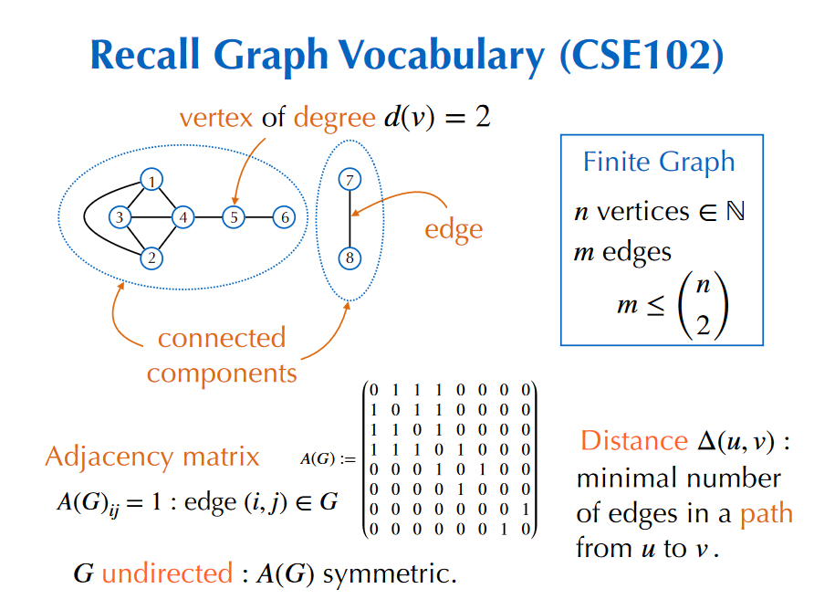

### Probabilistic Algorithm 

> **Input:** $u$ initial vertex, $v$ target vertex  
> While $u \neq v$  
> &ensp;&ensp;    Pick a neighbor $w$ of $u$ uniformly at random  
> &ensp;&ensp;    Set $u := w$  
> Return  

Random variable $X_k =$ vertex visited at $k$ th step $(X_0 = u)$.

Complexity: $T(u,v) := \mathbb{E}(inf\{k\geq 1|X_k = v\}) =$ ??, turns out to be polynomial in $n$.

**Lemma.** $$\sum_{v|(u,v)\in G} T(v,u) = 2m-d(u)$$
$\Rightarrow$ for any edge $(u,v), T(u,v) \leq 2m-1$.

**Prop1.** For arbitrary vertices $u,v,$
$$T(u,v) \leq (2m-1) \Delta (u,v)$$

**Prop2.** Expected time to visit all nodes:
$$T(u,\cdot) \leq 2m(n-1)$$

By Markov's inequality:
$$\mathbb{P}(v \text{ not visited in $4nm$ steps}) \leq 1/2$$

> Monte-Carlo algorithm in time $O(nm)$, memory $O(\log{n})$.

Negative answer: not in the same connected component.  
Comparison: depth first search uses $O(m)$ time _and_ memory.

## Satisfiability

### Boolean Formulas

Variables: $x_1,\dots,x_n$ with values in $\{0,1\}$ (= {false,true})  
Operations: negation ($\bar x$), or ($\vee$), and ($\wedge$)

_Satisfiability:_ existence of an assignment s.t. the statement is True  
_Clause:_ disjunction ($\vee$) of variables or their negations  
_Conjunctive normal form (CNF):_ conjunction ($\wedge$) of clauses

### k-SAT

**Def.** A $k$-SAT is a CNF where every clause involves at most $k$ of the $n$ variables.  

Simple algorithm: try all $2^n$ assignments.
> For $k\geq 3$, no polynomial-time algorithm is known.

$k>3$ reduced to $k=3$,using  
 $x_1 \vee x_2 \vee x_3 \vee x_4 \equiv (x_1\vee x_2 \vee T_1) \wedge (\bar T_1 \vee x_3 \vee x_4)$  
 with a new variable $T_1$.

## WalkSat

> **Input.** a k-SAT formula F in $n$ variables  
> **Output.** an assignment or FAIL  
> 1. Pick an assignment $B \in \{0,1\}^n$ uniformly at random.
> 2. Repeat $N$ times:  
> &ensp;&ensp; If the formula is satisfied by the assignment, return $B$.  
> &ensp;&ensp; Choose a clause $C$ not satisfied.  
> &ensp;&ensp; Pick a variable $x$ uniformly at random among the $C$'s  
> &ensp;&ensp; Update $B$ by flipping $x$  
> 3. Return FAIL

If $p_N$ is the probability of success, boost it by $t/p_N$ repeats.

### Analysis of Walksat when $k=2$

$$(\bar x_1 \vee \bar x_2) \wedge (x_2 \vee x_3) \wedge (x_1 \vee x_4) \wedge (\bar x_3 \vee x_4) \wedge \dots$$

Assume the existence of a satisfying assignment $A$. $d := dist(A,B) =$ number of variables where $A\neq B$.  

At each flip, $\Delta d = \pm 1$ and $\mathbb{P}(\Delta d = -1) \geq 1/2$.  

_Random walk_ on the graph $(0) -- (1) -- (2) -- \dots -- (n-1) -- (n)$  
Expected number of steps $\leq 2nd_0 \leq 2n^2$.  
> Stopping after $N = 4n^2$ steps gives $\mathbb{P}(success) \geq 1/2$.  

WalkSat fives a Monte-Carlo algorithm in time $O(n^2)$.

### Analysis for Larger $k$

Same worst-case reasoning gives $\mathbb{P}(\Delta d= -1) \geq 1/k$.  
Probability $p(d)$ of reaching $0$ starting from $d$ when $\mathbb{P}(\Delta d= -1) = 1/k$ (worst-case).

**Lemma.**
$$p(d) = (k-1)^{-d}$$  

Probability that WalkSat succeeds (with $N= \infty$):
$$\mathbb{P}(success) \geq 2^{-n} \sum_{d=0}^n \binom{n}{d} p(d) = \left(\frac{k}{2(k-1)}\right)^n$$  

When should it give up and restart?

### Stopping after $3n$ Steps for 3-SAT

$$\begin{align*}
&\mathbb{P}(\text{success in $3n$ steps starting from $d$}) \\
&\text{\quad} \geq \mathbb{P}(\text{success in $3d$ steps starting from $d$}) \\
&\text{\quad} \geq \binom{3d}{d} \left(\dfrac{2}{3}\right)^d \left(\dfrac{1}{3}\right)^{2d} \geq \dfrac{2^{-d}}{3d+1} \geq \frac{2^{-d}}{3n+1}
\end{align*}$$

Then, 
$$\mathbb{P}(success) \geq 2^{-n} \sum_{d=0}^n \binom{n}{d} \dfrac{2^{-d}}{3n+1} = \dfrac{(3/4)^n}{3n+1}$$

> WalkSat gives a Monte Carlo algorithm in time $\left(\dfrac{4}{3}\right)^n$ poly($n$).
</details>

<details>
<summary> Lecture 8</summary>
<p>

[PowerPoint](https://moodle.polytechnique.fr/pluginfile.php/483013/mod_resource/content/2/08-Amortization.pdf)

## Various Kinds of Complexity Analysis

_Worst-case_: bound the worst case scenario

_Amortized_: average the worst-case over a sequence of operations

_Average-case_: average complexity over random inputs of random executions


### 1. Dynamic Tables

#### Tables in Low-Level Languages:

Increasing te size of the table requires:
- allocationg a new array of memory;
- _copying_ the old array to the new one.

#### Dynamic tables:

Use three fields: size, capacity, pointer to the array (capacity is increased faster than size) 

Worst-Case cost of append: $O(size)$.

#### Amortized Cost of a Sequence of Append

Sequence of capacities:
$$t_{k+1} = \lfloor \alpha(t_k+1)\rfloor, \quad t_0=0$$

Total cost of $N$ apped: $C_N \leq N + \sum_{t_k\leq N}t_k$

> **Thm.** Amortized cost bounded by
> $$\dfrac{C_N}{N} \leq 1+ \dfrac{\alpha}{\alpha-1}$$

#### Deletion

Retrieve memory when the `size` of the table decreases

Dangerous scenario:
- increase by a factor $\alpha$ when full;
- decrease by a factor $1/\alpha$ when possible.

(copies too often if appen delete sequence like ADDAADD...)

_Solution:_ leave space to prepay for the next growth. 

```py
def pop(self):
  if self.size==0: raise IndexError
  res = self.table[self.size]
  self.resize(self.size-1)
  return res

def resize(self,newsize):
  if newsize> self.capacity or newsize< self.capacity/beta:
    self.realloc((int)(alpha*newsize))
  self.size = newsize
```

Charge for Insert unchanged:
$$1+ \dfrac{\alpha}{1-\alpha}$$

Charge for Delete: 
$$1+\dfrac{\alpha\beta}{1-\alpha\beta} \rightarrow 1+  \dfrac{\beta N}{(1/\alpha - \beta)N}$$

**Amortized cost $O(1)$ per operation**

#### Application to Hash Tables

Hash tables with linear probing require a filling ratio bounded away from 1. _Implemented with dynamic tables._

Resizing the table requires to rehash all the entries.

In Python, the hash function is computed once as a 64-bit integer, and stored with the object. Only its value mod the new size is recomputed.

### 2. Union-Find

Abstract Data Tpe for _Equivalence Classes_

Main Operations:
- `Find(p)`: identifier for the equivalence class of $p$
- `Union(p,q)`: add the relation $p \sim q$

#### Forests in Arrays
- $p = [2,3,2,3,10,6,6,6,10,6,2,11]$ 
- $p[i]:=parent(i)$ (init with $p[i]:=i$)
- ex.: Node $2$ is the parent of Node $0$

First Version:
```py
def find(p,a):
  while p[a]!=a: a=p[a]
  return a

def union(p,a,b):
  link(p,find(p,a),find(p,b))

def link(p,a,b):
  p[a] = b
```
Only `find` uses more than $O(1)$ array accesses

Worst-case:
```py
for i in range(N):
  union(p,0,i)
```
Uses $O(N^2)$ array accesses

#### Union by Rank

Maintain _rank_ (=height). Link short trees to higher ones.

```py
def link(p,a,b):
  if a == b: return
  if rk[b]>rk[a]: p[a] = b
  else: p[b] = a
  if rk[a]==rk[b]: rk[a]+=1
```

**Properties.**
- rank increases from leaf to root;
- size of tree $\geq 2^{rk(root)}$;
- num nodes of rank r $\leq \dfrac{n}{2^r}$

$\Rightarrow$ **Worst case for find: $O(\log{n})$.**

Ever `find` branches all the nodes it visits to their root. 

```py
def find(p,a):
  if p[a]!=a: p[a] =find(p,p[a])
  return p[a]
```

Preserves the properties of rank (becomes an upper bound on height). Worst-case for find unchanged.

> **Thm.** A sequence of $m\geq n$ `union` or `find` operations uses $O(m \log^{\star}n)$ array accesses.


$\log^{\star}n$: number of iterations of $\log_2$ before reaching $\leq1$. 

#### Link & compress

1. rewrite the sequence of $m$ `union` or `find` as a sequence of $O(m)$ `link` or `compress` 
    ```py
    def compress(p,a,b):
      # b ancestor of a
      if a!=b:
        compress (p,p[a],b)
        p[a] = p[b]
    ```
2. Perform the links first (each in $O(1)$ operations)

**Def.** $T(m,n,r)$ worst-case number of parent changes in $\leq m$ `compress` in a forst of $\leq n$ nodes, each of rank $\leq r$.

> Simple bound: $T(m,n,r) \leq nr$.

#### High and Low Forests

Split into two forests:
- rank of forest in total $r$
- Choose some $s$ 
- $F_+$ with all nodes with $r \geq rank > s$ 
- $F_-$ with all nodes with $rank \leq s$

```
Compress2(a,b,F):
if rk[a]>s then Compress2(a,b,F+)
elif rk[b]<=s then Compress2(a,b,F-)
else
  x = a
  while rk[p[x]]<=s and p[x]!=x:
    x = p[x]
  Compress2(p[x],b,F+)
  Shatter(a,x,F-) # new parent in F+
  p[x] = x # counts parent change within F+
```

- $m_-$ compress purely inside $F_-$
- $m_+ := m-m_-$

$C$ sequence of $m$ compress _splits_ into  
- $m_-$ compress in $F_-$, denoted $C_-$
- $m_+$ compress in $F_+$, denoted in $C_+$
- $|F_-| \leq n$ parent changes in Shatter
- $\leq m_+$ parent changes within $F_+$

$$T(m,n,r) = T(F,C) \leq T(F_+,C_+) + T(F_-,C_-) + m_+ + n$$

#### Conclusion 

For any sequence $C$ of length $\leq m$ in a forest with $n$ nodes of rank $\leq r$, 
$$T(F,C)-m \leq T(F_-,C_-)-m_- + T(F_+,C_+) + n$$

Where:
- $T(F,C) -m$ has $rk \leq r$
- $T(F_-,C_-)-m_-$ has $rk\leq s$
- $T(F_+,C_+) \leq \dfrac{rn}{2^s}$

Choose $s=\log_2{r}$
$$T(F,C)-m \leq T(F_-,C_-) -m_- + 2n$$

Iterating $\log^{\star}r$ times yields 

$$T(F,C) \leq m+2n\log^{\star}{r} = O(m\log^{\star}{n}) \quad (m\geq n, r\leq n)$$
 </details>

 <details>
<summary> Lecture 9</summary>
<p>

[PowerPoint](https://moodle.polytechnique.fr/pluginfile.php/483016/mod_resource/content/2/09-Balance.pdf)

## Data-Structures for Ordered Data

_Priority Queues:_ insert, findmax, deletemax  
_Ordered Search Trees:_ insert, find, delete, selectbyrank, floor, ceiling, countbetween, ...

Balanced Trees (all leaves in the same one or two levels) allow for all these operations in _worst-case time $O(\log{n})$._

### 1. Priority Queues & Heap-ordered Trees

**Recall Dijkstra's Algorithm (CSE103)**
```
while PQ not empty:
  remove first edge ((u,v,d(s,u))) from PQ
  if v not in the tree
    add v to the tree
    for all neighbours w of v
      insert ((v,w,d(s,v+d(v,w)) in PQ
```

**Heaps:** each node is larger than its children

_Operations:_ insert, findmax, deletemax

#### Basic operations

```py
def insert(self,key):
  self.size+= 1
  self.PQ[self.size] = key
  self.fixup(self.size)

def fixup(self,ind):
  if ind==1: return
  parent = ind // 2
  if self.PQ[parent] > self.PQ[ind]: return
  self.exch(parent,ind)
  self.fixup(parent)

# insert and fixup:
# <= log2(n) comparisons


def deletemax(self):
  self.PQ[1] = self.PQ[self.size]
  self.size-= 1
  self.fixdown(1)

def fixdown(self,ind):
  child = 2*ind
  if child > self.size: return
  if child < self.size and self.PQ[child+1]>self.PQ[child]:
    child+= 1
  if self.PQ[ind]<self.PQ[child]:
    self.exch(ind,child)
    self.fixdown(child)

# Deletemax and fixdown:
# <= 2log2(n) comparisons
```

### 2. Binary Search Trees

Recall Definition (CSE101 $ CSE103):
```py
class Node:
  def __init__(self,key,left=None,right = None):
    self.key = key
    self.left = left
    self.right = right

class BST:
  def __init__(self):
    self.root = None
  
  def find(self,key):
    return self._find(self.root,key)

  def insert(self,key):
    self.root = self._insert(self.root,key)
  
  def delete(self,key):
    self.root = self._delete(self.root,key)
```

#### Find / Insert

```py
def _find(self,node,key):
  if node is None: return False
  if node.key>key: return self._find(node.left,key)
  if node.key<key: return self._find(node.right,key)
  return True

def _insert(self,node,key):
  if node is None: return Node(key)
  if node.key>key:
    node.left = self._insert(node.left,key)
  elif node.key < key:
    node.right = self._insert(node.right,key)
  return node
```

_Worst-case:_ search in $O(n)$ comparisons for a BST built from $n$ trees


#### Average-Case Analysis

Internal path length:
- $P_n :=$ sum depthy of all nodes
- $P_n/n +1:$ average successful search
- $P_n/n +3:$ average unsuccessful search (=insert)

$$P_0 = P_1 = 0$$

$$\mathbb{E} [P_n] = n-1 \sum_{i=1}^n \dfrac{\mathbb{E}[P_{i-1}] + \mathbb{E}[P_{n-i}]}{n}$$

(Same recurrence as in the analysis of quicksort.)

> **Prop.** In a BST built from $n$ random keys, the average number of comparisons is $1.39\log_2{n} + O(1)$.

#### Select

min,max, floor, ceiling: easy

median, select:
change nodes into `key`, `left`, `right`, `size`

```py
def _insert(self,node,key):
  if node is None: return Node(key)
  if node.key > key:
    node.left = self._insert(node.left,key)
  elif node.key < key:
    node.right = self._insert(node.right,key)
  node.size = 1 + size(node.left) + size(node.right)
  return node
```

All these operations have cost bounded by the height, which is logarithmic on average.
</details>

<details>
<summary> Lecture 10</summary>
<p>

[PowerPoint](https://moodle.polytechnique.fr/pluginfile.php/483018/mod_resource/content/2/10-Balance.pdf)

## 2. Binary Search Trees

```py
class Node:

  def __init__(self,key,left=None,right=None)
    self.key = key
    self.left = left
    self.right = right

class BST:
  # smaller elements left, bigger elements right
  def __init__(self):
    self.root = None
  
  def find(self,key):
    return self._find(self.root,key)

  def insert(self,key):
    self.root = self._insert(self.root,key)

  def delete(self,key):
    self.root = self._delete(self.root,key)
```

### Find / Insert

```py
def _find(self,node,key):
  if node is None: return False
  if node.key > key: return self._find(node.left,key)
  if node.key < key: return self._find(node.right,key)
  return True

def _insert(self,node,key):
  if node is None: return Node(key)
  if node.key > key:
    node.left = self._insert(node.left,key)
  elif node.key < key:
    node.right = self._insert(node.right,key)
  return node
```

#### Analysis: worst-case

_Worst-case:_ search in $O(n)$ comparisons for a BST built from $n$ keys.

#### Analysis: average-case

Internal path length:
- $P_n:=$ sum depths of all nodes
- $\frac{P_n}{n}+1:$ average successful search
- $\frac{P_n}{n}+3:$ average unsuccessful search (=insert)

Same process as quicksort
- $P_0 = P_1 = 0$
- $\mathbb{E}[P_n] = n-1 + \sum_{i=1}^n \dfrac{\mathbb{E}[P_{i-1}]+\mathbb{E}[P_{n-i}]}{n}$

Same recurrence as in the analysis of quicksort

>**Prop.** In a BST built from $n$ random keys, the average number of comparisons for a search is:
> $$1.39\log_2{n} + O(1)$$

### Select

- min, max, floor, ceiling: easy

- median, select: change nodes into `key`, `left`, `right`, `size`

Changed insert:
```py
def _insert(self,node,key):
  if node is None: return Node(key)
  if node.key > key:
    node.left = self._insert(node.left,key)
  elif node.key < key:
    node.right = self._insert(node.right,key
  #------Added this line:---------
  node.size = 1+ size(node.left) + size(node.right)
  #---------------------------
  return node
```

All these operations have cost bounded by the height, which is logarithmic _on average_.

## 3. Red-Black BST

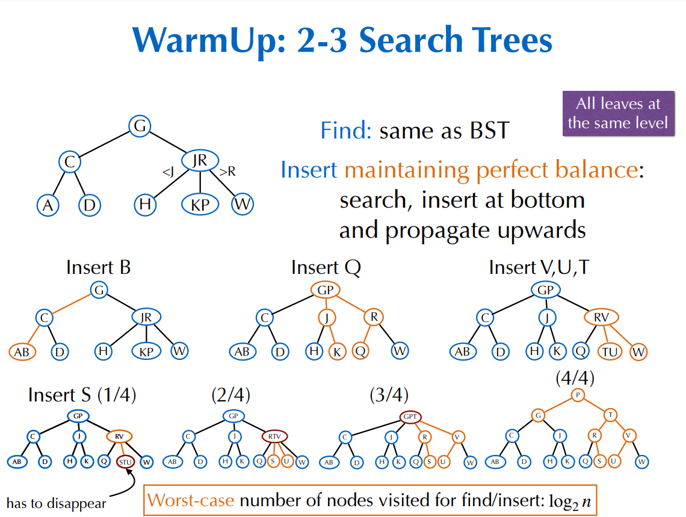

### (Left-Leaning Red-Black Trees)

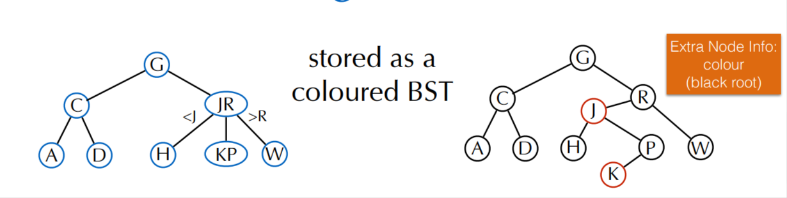


**Properties:**
1. red nodes are left children;
2. red nodes have black children;
3. every path from the root to a leaf has the same number of black nodes

Red-black trees with these properties are in 1-to-1 correspondance with 2-3 trees.

`find`, `select`: code for BST unchanged! Just faster.

### Insertion

`Insert` maintaining order & black balance: search, insert _red_ node at bottom and propagate upward

Changed insert:
```py
def __insert__(self,node,key):
  if node is None: return Node(key, red=True)
  if node.key > key:
    node.left = self._insert(node.left,key)
  elif node.key < key:
    node.right = self._insert(node.right,key)
  #--------added lines---------#
  if isRed(node.right) and not isRed(node.left): node = rotateleft(node)
  if isRed(node.left) and isRed(node.left.left): node = rotateright(node)
  if isRed(node.left) and isRed(node.right): flipcolors(node)
  #---------------------------------#
  node.size= 1+size(node.left)+size(node.right)
  return node
```

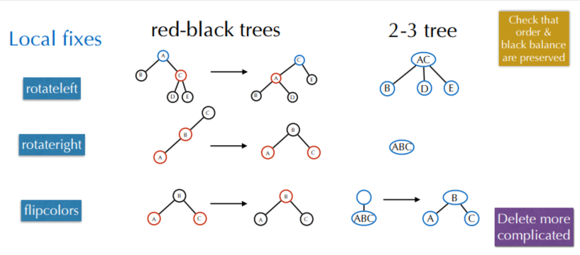

#### Worst-case analysis

> **Prop.** The height of a red-black BST with $n$ nodes is bounded by $2\log_2{n}$.

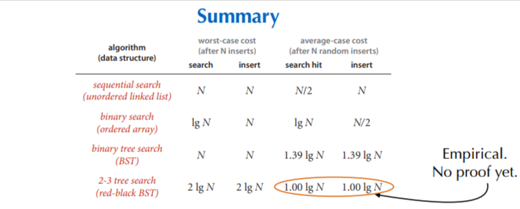 

## B Trees

Multi-way search trees commonly used in database systems (disk storage) - extension of 2-3 search trees

> **Definition (B-tree of order $t\geq3$):** 
> 1. The root is either a leaf or has between 2 and $t$ children
> 2. Non-leaf nodes (except the root) have between $\lceil t/2 \rceil$ and $t$ children
> 3. All leaves are at the same depth. Each leaf stores between $\lceil t/2 \rceil$ and $t$ items

Example of a B-Tree:

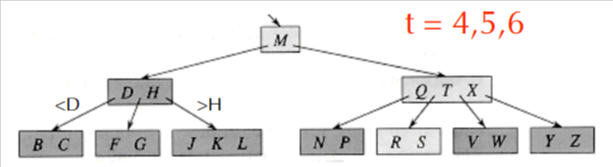

Each internal node of a B-tree has:
- between $\lceil t/2 \rceil$ and $t$ children
- up to $t-1$ keys $k_1<k_2 < \dots < k_{t-1}$

### B-Trees: Find

For a B-Tree of order $t$:
- each internal node has up to $t-1$ keys to search
- each internal node has between $\lceil t/2 \rceil$ and $t$ children
- depth of B-tree storing $n$ items: $O(\log_{\lceil t/2 \rceil}{N})$

Complexity:
- $O(\log_2{t})$ to binary search which branch to take at a node
- Total time to find an item:
    $$O(\log_2{t} \cdot \log_{\lceil t/2 \rceil}{N}) = O(\log_2{N})$$

```py
class Node:
  def __init__(self, leaf = False):
    self.leaf = leaf
    self.keys = []
    self.children = []

class BTree:
  def __init__(self,t):
    self.root = Node(True)
    self.t = t

  def search(self,k):
    x = self.root
    i = 0
    while i < len(x.keys) and k > x.keys[i][0]:
      i += 1
    if i<len(x.keys) and k == x.keys[i][0]:
      return (x,i)
    elif x.leaf:
      return None
    else:
      return self.search(k,x.child[i])
```

### B-Trees: Insertion

**Insert x (similar to 2-3 search trees):** Do a find on x and find appropriate leaf node
- if leaf node is not full, fill in empty slot with x
- if leaf node is full (has t items):
  - split into two nodes with $\lfloor (t+1)/2 \rfloor$ and $\lceil (t+1)/2 \rceil$ children
  - adjust parents up to the root node

$$O(t \cdot \log_{\lceil t/2 \rceil}{N}) = O((t/\log_2{t})\cdot \log_2{N})$$

```py
def insert(self,k):
  root = self.root
  if len(root.keys) == self.t -1:
    temp = Node()
    self.root = temp
    temp.child.insert(0,root)
    self.split_child(temp,0)
    self.insert_non_full(temp,k)
  else:
    self.insert_non_full(root,k)

def insert_non_full(self,x,k):
  i = len(x.keys) - 1
  if x.leaf:
    x.keys.append((None,None))
    while i >= 0 and k[0] < x.keys[i][0]:
      x.keys[i+1] = x.keys[i]
      i -= 1
    x.keys[i+1] = k
  else:
    while i>= 0 and k[0] < x.keys[i][0]:
      i-=1
    i+=1
    if len(x.child[i].keys) == self.t-1:
      self.split_child(x,i)
      if k[0] > x.keys[i][0]:
        i+= 1
      self.insert_non_full(x.child[i],k)

def split_child(self,x,i):
  t = self.t
  y = x.child[i]
  z = Node(y.leaf)
  x.child.insert(i+1,z)
  x.keys.insert(i,y.keys[ceil(t/2)])
  z.keys = y.keys[ceil(t/2):t]
  y.keys = y.keys[0:ceil(t/2)]
  if not y.leaf:
    z.child = y.child[ceil(t/2):t]
    y.child = y.child[0:ceil(t/2)]
```

Tree in internal memory: $t=3$ or $4$  
Tree on disk: $t=32$ to $256$ (inferior and leaf nodes fit on 1 disk block)
  - depth = 2 or 3 -> fast access to databases
</details>

<details>
<summary> Lecture 10</summary>
<p>

[PowerPoint](https://moodle.polytechnique.fr/pluginfile.php/483020/mod_resource/content/3/11-StringSearch.pdf)

## Strings

**Definitions.**
- letter = character = symbol (usually 7,8, or 16 bits);
- alphabet: set of letters (often denoted $\Sigma$ and $R = |\Sigma|$);
- string = word = text: _finite_ sequence of letters;
- length = size of a word: number of letters.

## Substring Search

_Input:_ two strings (text $T$ and pattern $P$)  
_Output:_ answer to "is $P$ a substring of $T$?"  
_Aim:_ small number of character accesses

Known algorithms ($|T|=n; |P|=m$):  
||worst case|average case|  
|---:|---|---|  
|Brute force|$\leq nm$|$\leq 2(n-m+1)$|  
|Knuth-Morris-Pratt|$\leq n+m$|$\geq n$|  
|Boyer-Moore|$\leq 3n$|$\approx n/m$|  

### 1. Brute Force

```py
def bruteforce(text,pattern):
  for i in range(len(text)-len(pattern)):
    for j in range(len(pattern)):
      if text[i+j]!=pattern[j]:break
    else: return i
  return -1
```
_Worst-case:_ $P=a^{m-1}b, T=a^{n-1}b \rightarrow m(n-m+1)$ comparisons 

**Expected Number of Comparisons for All Matches**  
Fixed pattern, uniform random text  

|# of texts of length $n$ having...|| 
|---|---|  
|at least the $k$ first letters of the pattern at a given location|$$R^{n-k}$$|  
|exactly the k first letters of the pattern at a fiven location|$$R^{n-k}-R^{n-k-1}$$|
|# of comparisons at this location|$$\sum_{k=0}^m (k+1)(R^{n-k}-R^{n-k-1}) \leq \dfrac{R^n}{1-1/R}$$|  
|# of comparisons at all locations:|$$\leq \frac{(n-m+1)R^n}{1-1/R}$$|  

_Expectation_ $\leq \dfrac{n-m+1}{1-1/R}$.

### 2. Knuth-Morris-Pratt

Pattern compiled into Automaton

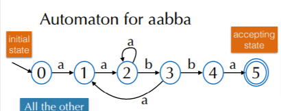

(All the other transitions point to 0)

Text ex.:

||b|b|a|b|a|a|a|b|a|a|b|b|a|b|b|
|---|---|---|---|---|---|---|---|---|---|---|---|---|---|---|---|   
|0|0|0|1|0|1|2|2|3|1|2|3|4|5|


>**Def.** Deterministic Finite Automaton  
>- a finite set $Q$ fo states;
>- a _transition function_ $\delta: Q\times\Sigma\rightarrow Q$;
>- an _initial_ state;
>- one or several _accepting_ states.

```py
def kmp(text,dfa):
  m=len(dfa)
  s=0
  for i in range(len(text)):
    s=dfa[s].get(text[i],0)
    if s==m: return i
  return -1
```

When a match fails at index $i$ in the pattern, $i-1$ characters of the text are known $\longrightarrow$ imagine starting over from the 2nd one.  

```py
def preprocess(pattern):
  m=len(pattern)
  # dfa[state][key] gives new state
  dfa=[{} for i in range(m)]
  dfa[0][pattern[0]]=1
  state = 0

  for i in range(1,m):
    for key in dfa[state]: dfa[i][key] = dfa[state][key]
    state = dfa[state].get(pattern[i],0)
    dfa[i][pattern[i]] = i+1
```

### 3. Boyer-Moore

```py
# lcs - least character shift
# bms - boyer-moore shift
def bm(text,pattern, lcs,bms):
  n= len(text)
  m = len(pattern)
  i = 0
  while i<=n-m:
    for j in range(m-1,-1,-1):
      if text[i+j]!=pattern[j]:
        i+=max(1,j-lcs.get(text[i+1],-1),bms[j])
        break
    else: return i
  return -1

def lastoccurence(pattern):
  m = len(pattern)
  lcs = {}
  for i in range(m-1):
    lcs[pattern[i]] = i
  return lcs
```
Worst-case for last character heuristic: $P=ba^{m-1}, T=a^n$

Average-case complexity: $\mathbb{E}[\text{\# of comparisons}]\approx n/m$ for large $R/m$

#### Shift by Longest Suffixes

$bms[j]:= min \left \{ s > 0 | (\forall k \in \{j+1, \dots, m\}: s>k \vee P[k-s] = P[k]) \wedge (s>j \vee P[j-s]\neq P[j])   \right \}$

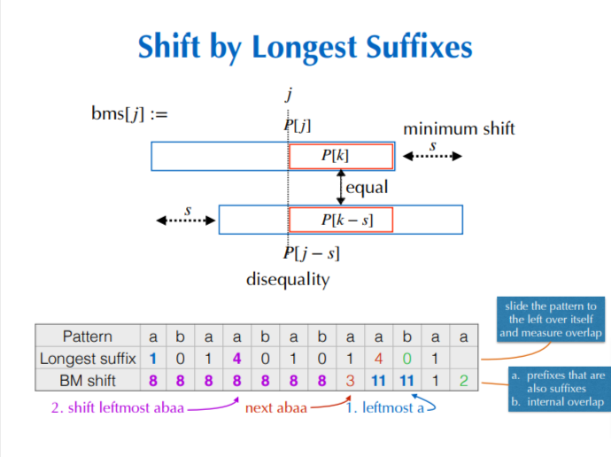

Corresponding code:

```py 
def longestsuffix(pattern):
  m=len(pattern)
  ls=[0]*(m-1)
  for i in range(m-1,-1,-1):
    for j in range(i+1):
      if pattern[m-1-j] == pattern[i-j]:
        ls[i] += 1
      else: break
  return ls

def bmshift(pattern):
  ls = longestsuffix(pattern)
  m = len(pattern)
  bms = [m]*m
  j = 0
  for i in range(m-2,-1,-1):
    if ls[i]==i+1:
      for j in range(j,m-i,-1): bms[j]=m-1-i
  for i in range(m-1):
    bms[m-1-ls[i]] = m-1-i
  return bms
```

</details>