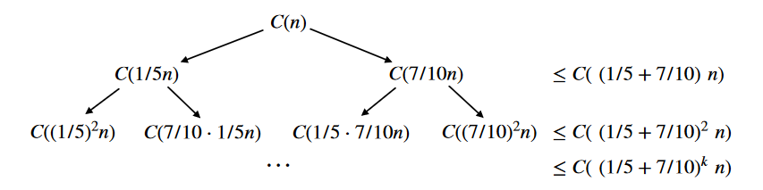

# CSE202: Design and Analysis of Algorithms

<p>

[Moodle Page](https://moodle.polytechnique.fr/course/view.php?id=14939)

<details><summary>Lecture 1</summary>
  
<p>

[Power point](https://moodle.polytechnique.fr/pluginfile.php/482989/mod_resource/content/2/01-overview.pdf)
  
## Algorithms

An algorithm needs:
 1. A well-specified problem
 2. A method to solve it


An algorithm is *correct* if 
 1. it terminates
 2. it computes what its specification claims

Useful proof technique: look for **variants** and **invariants**:

```python
# Input:  x that can be multiplied
#         n nonnegative integer
# Output: x^n
def binpow(x,n):
  if n==0: return 1
  # n>0
  tmp = binpow(x,n//2) # n//2 < n
  # tmp = x^(n//2)
  tmp = tmp*tmp
  if n%2==0: return tmp
  return tmp*x
```

**Termination** is a very hard problem
- the general problem is **undecidable**

## Complexity

*How long will my program take?*
*Do I have enough money?*
  
The scientific approach:
  1. Experiment for various sizes;
  2. Model;
  3. Analyze the model;
  4. validate with experiments;
  5. If necessary, go to 2.
                                 
### Experimental Determination of (Polynomial) complexity

If the time for a computation grows like $C(n) \sim Kn^\alpha log^pn$ <br>
then doubling $n$ should take time $C(2n) \sim K2^\alpha n^\alpha log^pn$ <br>
so that $$\alpha \approx log_2 \left ( \dfrac{C(2n)}{C(n)} \right ) $$

### Notation

- $ f(n) \sim g(n) $ means $  \lim_{n\to\infty} f(n)/g(n) = 1  $
- $ f(n) = O(g(n)) $ means $ \exists K \exists M \forall n \geq M, |f(n)| \leq Kg(n) $
- $ f(n) = \Theta (g(n)) $ means $ f(n) = O(g(n)) $ and $ g(n) = O(f(n)) $

### Moore's "law"

The expression Moore's "law" is commonly used to mean that
> The speed and memory of computers is expected to **double every 18 months**.


## Lower Bounds

### Complexity of a problem

***Def.*** The *complexity of a problem* is that of the most efficient (possibly unknown) algorithm that solves it.

**Ex.** Sorting $n$ elements has complexity $O(nlogn)$ comparisons <br>
**Proof.** Mergesort (CSE103) reaches the bound

**Ex.** Sorting $n$ elements has complexity $\Theta (nlogn) $ comparisons. <br>
**Proof.** $k$ comparisons cannot distinguish more than $2^k$ permutations and $log_2(n!) \sim n log_2 (n)$

### Complexity of Powering

$$ (x,n) \in \mathbb{A} \times \N \mapsto x^n \in \mathbb{A} $$

We already know it is $O(logn)$ multiplications in $\mathbb{A}$ <br>
*Can this be improved?*

> **Lower bounds** on the complexity require a precise definition (a **model**) of what operations the "most efficient" algorithm can perform.

**Ex.** If the only available operation in $\mathbb{A}$ is multiplication, $x^{2^k}$ requires $k$ multiplications, so that $log_2n$ is a lower bound.

**Ex.** In floating point arithmetic, $x^n = exp(nlogx)$ and the complexity hardly depends on $n$.

### Simple lower bounds

In most useful models, reading the input and writing the output take time. Then, 
$$\text{size(Input) + size(Output) } \leq \text{complexity}$$

## Reductions

Problem X **reduces to** problem Y if you can use an algorithm that solves Y to help solve X.
$$\text{Complexity of solving X} = \text{complexity of solving Y} + \text{cost of the reduction}$$

- complexity of solving Y: perhaps many calls to Y on instances of different sizes (typically, one call)
- cost of the reduction: preprocessing and postprocessing (typically, less than the cost of solving Y)
</details>

<details>
<summary>Lecture 2</summary>


[PowerPoint](https://moodle.polytechnique.fr/pluginfile.php/482992/mod_resource/content/2/02-Multiplication.pdf)

## Divide & Conquer 
### Example 1: How fast can we multiply?

- input: two $n$-digit integers
- output: at most $2n$ digits

<p>

- naive school multiplication:
  - each row: $n$ multiplications + $O(n)$ carries
  - last row: $O(n^2)$ additions + $O(n)$ carries
  - Total: $O(n^2)$ digit (or bit) operations

- Quadratic algorithm: #operations $O(n^2)$ for an input size $n$

<p>

The total cost may be
- mostly at the top (quickselect)
- mostly at the leaves (Karatsuba, Strassen)
- balanced along the levels (binary powering, mergesort)

### Polynomials

- Polynomials behave like integers, without carries
- cost: $(n_1+1)(n_2+1)$ multiplications + $O(n_1n_2)$ additions
<p>

$F$ and $G$ of degree $< n \mapsto H :=FG$

Algorithm: 
1. if $n=1$, return $FG$
2. Let $k:= \lceil\frac{n}{2}\rceil$
3. Split $F=F_0 + x^kF_1, G= G_0+x^kG_1$ <br>
    $F_0,F_1,G_0,G_1$ of degree $<k$
4. compute **recursively** <br>
  $H_0 := F_0G_0, H_1 := F_0G_1, H_2 := F_1G_0, H_3 :=F_1G_1$
5. return $H_0+x^k(H_1+H_2) + x^{2k}H_3$

**Complexity**: $C(n) \leq 4C( \lceil\frac{n}{2}\rceil) + \lambda n$ coefficient operations

$$

\begin{align*}
C(n) &\leq 4C( \left\lceil\frac{n}{2}\right\rceil) + \lambda n \\
&\leq \lambda n +  4\lambda ( \left\lceil\frac{n}{2}\right\rceil) + 16 C( \left\lceil\frac{n}{2}\right\rceil _2) \\ 
&\leq \lambda (n +  2 (2 \left\lceil\frac{n}{2}\right\rceil) +\dots + 2^{k-1}( 2^{k-1} \left\lceil\frac{n}{2}\right\rceil _{k-1})) + 4^{k+1}C(\left\lceil\frac{n}{2}\right\rceil _k) \\ 
&\leq \lambda N (1+2+\dots+2^{k-1}) + 4^kC\left(\left\lceil\frac{n}{2}\right\rceil_k\right) \\
&\leq 4^k\left(\lambda \dfrac{N}{2^k} + C(\left\lceil\frac{n}{2}\right\rceil_k) \right) \\
&\leq (\lambda +1)4^{\lceil\log_2n\rceil}= O(n^2)
\end{align*}
$$


Notation: 
- $\left\lceil\frac{n}{2}\right\rceil_1 = \left\lceil\frac{n}{2}\right\rceil $ 
- $\left\lceil\frac{n}{2}\right\rceil_{k+1} = \left \lceil \left\lceil\frac{n}{2}\right\rceil_k/2 \right \rceil$ 
- $N:$ power of $2$ s.t. <br>
$n \leq N < 2n$

#### Polynomials of Degree 1

$$F= f_0+f_1T, G= g_0+g_1T \mapsto G:= FG = h_0 + h_1T+ h_2T^2$$

Naive algorithm:
$$H = (f_0g_0) + (f_0g_1+f_1g_0)T+ f_1g_1T^2$$
Thus: $4$ multiplications and $1$ addition

Interpolation from **$3$** values:

$$\begin{align*}
h_0 &= F(0)G(0) = f_0g_0 \\
h_2 &= "F(\infty)G(\infty)" = f_1g_1 \\
\tilde h_1 &= h_0 + h_1 + h_2 = F(1)G(1) = (f_0+f_1)(g_0+g_1) 
\end{align*}$$
$$FG = h_0 + (\tilde h_1-h_0-h_2)T + h_2T^2$$
**$3$** multilplications, $2$ additions, $2$ substractions

#### Karatsuba's Algorithm

$F$ and $G$ of degree $<n \mapsto H :=FG$

**Idea**: Evaluate $FG = h_0 + (\tilde h_1-h_0-h_2)T + h_2T^2$ at $T=x^k$

Algorithm: 
1. if $n$ is small, use naive multiplication
2. Let $k:= \lceil\frac{n}{2}\rceil$
3. Split $F=F_0 + x^kF_1, G= G_0+x^kG_1$ <br>
    $F_0,F_1,G_0,G_1$ of degree $<k$
4. compute **recursively** <br>
  $H_0 := F_0G_0, H_2 := F_1G_1, \tilde H_1 :=(F_0+F_1)(G_0+G_1)$
5. return $H_0+x^k(\tilde H_1 - H_0 -H_2) + x^{2k}H_2$

Complexity: $C(n) \leq 3C(\left\lceil\frac{n}{2}\right\rceil) + \lambda n$ coefficient operations

$$
\begin{align*}
C(n) &\leq 3C( \left\lceil\frac{n}{2}\right\rceil) + \lambda n \\
&\leq \lambda n +  3\lambda ( \left\lceil\frac{n}{2}\right\rceil) + 9 C( \left\lceil\frac{n}{2}\right\rceil _2) \\ 
&\leq \lambda N (1+\frac{3}{2}+\dots+(\frac{3}{2})^{k-1}) + 3^kC\left(\left\lceil\frac{n}{2}\right\rceil_k\right) \\
&\leq \lambda N \left(\frac{3}{2}\right)^{k-1}(1+\frac{2}{3}+\dots+(\frac{2}{3})^{k-1}) + 3^kC\left(\left\lceil\frac{n}{2}\right\rceil_k\right) \\
&\leq 3^k\left(2\lambda \dfrac{N}{2^k} + C(\left\lceil\frac{n}{2}\right\rceil_k) \right) \\
&\leq (2\lambda +1)3^{\lceil\log_2n\rceil}= O(n^{\log_23})
\end{align*}
$$

### Integers

#### Karatsuba's Algorithm for Integers

$F$ and $G$ integers $<2^n \mapsto H:=FG$

Algorithm: 
1. if $n$ is small, use naive multiplication
2. Let $k:= \lceil\frac{n}{2}\rceil$
3. Split $F=F_0 + 2^kF_1, G= G_0+2^kG_1$ <br>
    $F_0,F_1,G_0,G_1<2^k$
4. compute **recursively** <br>
  $H_0 := F_0G_0, H_2 := F_1G_1, \tilde H_1 :=(F_0+F_1)(G_0+G_1)$
5. return $H_0+2^k(\tilde H_1 - H-0 -H_2) + 2^{2k}H_2$

Same algorithm as for polynomials, *similar* (not exactly the same) complexity analysis.

***$\rightarrow O(n^{\log_23})$*** bit operations

### Matrices

Input: two $n \times n$ matrices $A,X$ with $n=2^k$ 
<br>
Output: $AX$ with $AX_{ij} := \sum_{k=1}^nA_{ik}X_{kj}$


Strassen's algorithm:
1. if $n=1$, return $AX$
2. Split $A = \begin{pmatrix} a & b \\ c & d \end{pmatrix}, X = \begin{pmatrix} x & y \\ z & t \end{pmatrix}$ with $(n/2) \times (n/2)$ blocks
3. Compute recursively the $7$ products <br>
$q_1 = a(x+z), q_2 = d(y+t), q_3 = (d-a)(z-y),$ <br>
$q_4 = 8b-d)(z+t), q_5 = (b-a)z, q_6 = (c-a)(x+y), q_7 = (c-d)y$
4. Return $\begin{pmatrix}
q_1+q_5 & q_2+q_3+q_4-q_5 \\
q_1 + q_3 + q_6 - q_7 & q_2 + q_7
\end{pmatrix}$

### Application: Graph Transitive Closure

**Def.** A *graph* is a pair $(V,E)$ where
1. $V$ is a finite set of nodes/vertices
2. $E \subseteq V \times V$ is a finite set of edges

Can be described as Adjacency matrix (Boolean matrix)

Boolean Multiplication:
$$c_{ij} = \bigvee_{k=1}^na_{ik}\wedge b_{kj}$$

Let $G=(V,E)$ be a graph.

A *path from i to j* is a sequence of edges $e1,\dots e_n$ such that:
- the source of $e_1$ is i and the target of $e_n$ is j
- For every $1\leq k <n$, the target of $e_k$ is the source of $e_{k+1}$

The *transitive closure* $G^* = (V,E^*)$ is the graph where $(u,v) \in E^*$ iff there is a path from u to v

If A is the adjancency matrix of a graph G, then 

- $(A^k)_{ij} = 1$ iff there is a *path of length k* from i to j
- if $I$ is the identity matrix, then $(A \vee I)^k_{ij} = 1$ iff there exists a *path of length at most k* from i to j
-  $(A \vee I)^{n-1}$ is the adjacency matrix of G^*

The matrix $(A \vee I)^{n-1}$ can be computedd by *log n* squaring operations/multiplications $$O(n^{\log_27}\cdot \log_2n)$$

</details>

<details>
<summary>Lecture 3</summary>
<p>

[PowerPoint](https://moodle.polytechnique.fr/mod/resource/view.php?id=304169)

## Comparing Rankings

How similar are two rankings of n objects?

**Kendall-tau distance**
 : number of inversions between two rankings 

- inversion = pair $i < j$ such that $A[i]>A[j]$ 
- same as number of lines crossing when connecting same objects in two rankings

Algorithm: <br>
_Input._ An array A <br>
_Output._ Number of paris $i<j$ such that $A[i]>A[j]$

Complexity: <br>
Brute force algorithm: check all $O(n^2)$ pairs $i$ and $j$ <br>
Divide and Conquer: $O(n \log n)$

### Counting inversions: DAC

1. Divide into 2 sublists of equal size
2. Recursively count the inversions
3. Combine: add recursive counts plus inversions between sublists 

Variation of **merge-sort** <br>
**Combine:** count inversions between sublists
- assume each half is sorted
- count inversions where $A[i]$ and $A[j]$ are in different halves
- merge two halves into sorted whole 

**Merge and count**: count inversions while merging the two sorted lists

### Sort and Count Algorithm

```
Sort-and-Count(A):
  if A has one element
    return (0,A)

  Divide A into two halves A1,A2
  (r1,A1) <- Sort-and-Count(A1)
  (r2,A2) <- Sort-and-Count(A2)

  (rC,A) <- Merge-and-Count(A1,A2)
  return (r1+r2+rC,A)
```
```
Merge-and-Count(A1,A2):
  initialize an empty array B
  Inv <- 0

  if A1 or A2 is empty 
    return (0,nonempty list)

  Compare first elems of A1, A2
  If the smallest is in A1:
    move it at the end of B
  Else
    move it at the end of B
    Inv += |A1|

  return (Inv,B)
```
Complexity:

$$
\begin{align*}
C(n) &\leq 2C(\lceil n/2 \rceil) + \lambda n \\
&\leq \lambda n 2\lambda \lceil n/2 \rceil + 4C(\lceil n/2 \rceil_2) \\
&\leq \lambda N (1+1+1+\dots+1) + 2^kC(\lceil n/2 \rceil_k) \\
&\leq \lambda N (k-1) +  2^kC(\lceil n/2 \rceil_k) \\
&= \lambda n (\lceil\log_2 n \rceil-1) + 2^{\lceil \log_2n\rceil} \\
&= O(n\log n)
\end{align*}$$
(Where $N$: power of $2$ s.t. $n \leq N < 2n$)

## Selection: Linear Time with DAC

Complexity of DAC algorithms: <br>
- $O(\log n)$: binary powering
- $O(n \log n)$: merge sort, counting inversions
- $O(n^{\log_23}\approx n^{1.58})$: Karatsuba multiplication (integers, polynomials)
- $O(n^{\log_27}\approx n^{2.80})$: Strassen's matrix multiplication

### Statement of the Problem:

_Select:_ $(A:= \{a_1,\dots,a_n\},k) \mapsto x \in A$ s.t. $|\{a\in A| a \leq x\}| = k$

**Algorithm:** 
```
Select(A,k):
  If |A| = 1, return A[0]
  Choose a good pivot p
  q := Partition(A,p)
  If q=k return q
  If q>k return Select(A[:q],k)
  If q<k return Select(A[q:],k-q)
```
Worst case: $C(n) \leq C(n) + O(n) \rightarrow O(n^2)$

Complexity depends on $\left | q- |A|/2 \right |$ being small, need to choose good pivot

### Selection in worst-case linear time

_Goal._ Find pivot element p that divides list of n elements into two pieces so that each piece is guaranteed to have $\leq 7/10 n$ elements.

_Q._ How to find approximate median in linear time? <br>
_A._ recursively compute median of sample of $\leq 2/10n$ elements

$$
C(n) = 
  \begin{cases} 
  \Theta (1), &\text{if } n=1 \\
  C(7/10n) + C(2/10n) + \Theta (n), &\text{otherwise}
  \end{cases}
$$
To prove: $C(n) = \Theta (n) $

### Median-of-medians selection algorithm
```
MOM-Select(A,k):
  n <- |A|
  if n < 50:
    return k-th smallest element of A via mergesort
  Group A into n/5 groups of 5 elements each (ignore leftovers)
  B <- median of each group of 5
  p <- MOM-Select(B,n/10)

  (L,R) <- Partition(A,p)
  if (k<|L|) return MOM-select(L,k)
  else if (k>|L|) return MOM-select(R,k-|L|)
  else return p 
```

#### Complexity Analysis:

- At least half of $5$-element medians $\leq p$
- At least $(n/5)/2=n/10$ medians $\leq p$
- At least $3n/10$ elements $\leq p$ ($3$ for each median) 
- By same logic: At least $3n/10$ elements $\geq p$

MOM selection algorithm recurrence:
- select called recursively with $n/5$ elements to compute MOM $p$ <br>($=C(\lfloor n/5 \rfloor)$)
- at least $3/10 n$ elements $\leq p$
- at least $3/10 n$ elements $\leq p$
- select called recursively with at most $n-(3/10n)$ elements <br>($=C(n-3\lfloor n/10 \rfloor)$)
- computing median of $5$: $\leq 6$ comparisons per group <br>($=6/5n$)
- partitioning: $\leq n$ comparisons <br>($=5/5n$)

$$C(n) \leq C(\lfloor n/5 \rfloor)+C(n-3\lfloor n/10 \rfloor) + \frac{11}{5}n$$

#### Recurrence: 
$$C(n) \leq C(1/5n)+C(7/10n)+\lambda n$$
$$C(x) + C(y) \leq C(x+y) \text{ (super-additive)}$$

<!-- 
$$\begin{align*}
  & & & &C(n) & & & & \\
  & &C(1/5n) & & & &C(7/10n) & &\leq C((1/5+7/10)n) \\
  &C((1/5)^2n) & &C(7/10\cdot 1/5 n) & &C(1/5 \cdot 7/10 n) & &C((7/10)^2n) &\leq C((1/5+7/10)^2n) \\
  & & & &\dots & & & &\leq C((1/5+7/10)^kn) 
\end{align*}$$
-->



$$
\begin{align*}
C(n)&\leq C(9/10n) + \lambda n \\
&\leq C((9/10)^2n) + \lambda n (1+9/10) \\
&\leq C((9/10)^3n) + \lambda n(1+9/10+(9/10)^2) \\
& \dots \\
&\leq C(n_0) + \lambda n(1+9/10+(9/10)^2+\dots) \\
&\leq C(n_0) + \lambda n \cdot 10 = O(n)
\end{align*}
$$

</details>